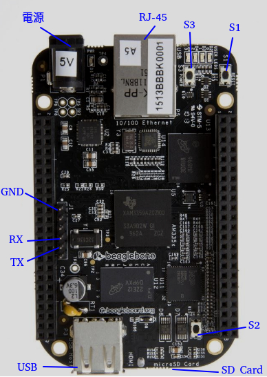

# U-Boot 編譯與 SD 卡安裝流程

## 1. 下載 U-Boot 原始碼

```bash
git clone git://git.denx.de/u-boot.git
cd u-boot
git checkout v2026.07
```

- `git clone`：下載 U-Boot 原始碼
- `cd u-boot`：進入專案目錄
- `git checkout v2026.07`：切到指定版本，保持與文件一致

---

## 2. 設定交叉編譯環境

```bash
PATH=${HOME}/x-tools/arm-cortex_a8-linux-gnueabihf/bin/:$PATH
export CROSS_COMPILE=arm-cortex_a8-linux-gnueabihf-
export ARCH=arm
```

- `PATH=...`：把交叉編譯器加入 `PATH`，讓系統能找到 `arm-...-gcc`
- `export CROSS_COMPILE=arm-cortex_a8-linux-gnueabihf-`：指定交叉編譯器前綴，讓 U-Boot 使用 ARM 工具鏈
- `export ARCH=arm`：設定目標架構為 ARM，讓 Makefile 選擇正確的內建配置

---

## 3. 清理舊編譯結果

```bash
make mrproper
```

- `make mrproper`：清除先前的編譯產物與配置檔
- 這一步會把目錄還原到乾淨狀態，避免舊設定干擾新的編譯
- 這種清理方式在 Linux/Kconfig 型專案中很常見

---

## 4. 設定目標開發板

```bash
make am335x_evm_defconfig
```

- `make am335x_evm_defconfig`：載入 AM335x EVM 的預設設定
- 這是 U-Boot 對 BeagleBone Black / AM335x 平台的基礎設定

---

## 5. 編譯 U-Boot

```bash
make -j$(nproc)
```

- `make -j$(nproc)`：使用多核心編譯，加快建置速度
- `$(nproc)` 會自動抓取 CPU 核心數
- 編譯完成後會產生主要映像檔

編譯後會用到：
- `MLO`：SPL（Secondary Program Loader）
- `u-boot.bin`：U-Boot 主映像

---

## 6. 安裝 U-Boot 到 SD 卡

### 6.1 先確認 SD 卡裝置名稱

```bash
lsblk
```

- `lsblk`：列出系統中所有區塊裝置
- 目的是確認 SD 卡實際裝置名稱，例如 `sdb`
- 這一步必須小心，避免寫錯磁碟造成資料損失

範例：

```text
sdb         8:16   1   3.7G  0 disk
├─sdb1      8:17   1    64M  0 part /media/jb/boot
└─sdb2      8:18   1     1G  0 part /media/jb/rootfs
```

假設 SD 卡是 `sdb`，後面可以用 `$SD` 代表它。

---

### 6.2 安全檢查與 SD 卡識別

在把 SD 卡直接做分區或寫入資料前，最好先確認這張卡的型號、容量與裝置名稱，避免誤操作到錯誤的磁碟。

#### 1) 先確認裝置是否真的是 SD 卡

```bash
lsblk
sudo fdisk -l
```

- `lsblk`：列出所有 block device，檢查 SD 卡名稱，例如 `sdb`、`mmcblk0`
- `sudo fdisk -l`：顯示所有磁碟與分區資訊，確認容量和裝置類型
- 目的是找出真正的 SD 卡，而不是 USB 硬碟、外接 SSD 或系統內建磁碟
- 一般 SD 卡的容量通常在 4GB、8GB、16GB、32GB 左右，若容量異常大或為空裝置，應該要再確認一次

> 如果你看到的是 `/dev/sdb`、`/dev/mmcblk0` 這類裝置，且容量接近 SD 卡大小，就可以繼續進行下一步；如果不是，請不要直接格式化。

#### 2) 先卸載所有已掛載分區

```bash
sudo umount /dev/${SD}1 /dev/${SD}2
```

或如果是 MMC 卡：

```bash
sudo umount /dev/mmcblk0p1 /dev/mmcblk0p2
```

- `umount`：解除磁碟已掛載的分區
- 這一步很重要，因為一旦分區被系統掛載，後續寫入分區表或格式化可能會失敗

#### 3) 判斷 SD 卡是 `sdX` 還是 `mmcblkX`

```bash
lsblk -o NAME,SIZE,TYPE,MOUNTPOINT
```

- `lsblk -o NAME,SIZE,TYPE,MOUNTPOINT`：方便看清楚每個裝置名稱與對應的分區格式
- 如果裝置名稱是 `mmcblk0`，分區通常是 `mmcblk0p1`、`mmcblk0p2`
- 如果裝置名稱是 `sdb`，分區通常是 `sdb1`、`sdb2`

這一步的目的，是為了後續設定正確的 `BOOT_PART` 和 `ROOT_PART` 路徑。

#### 4) 檢查 `sfdisk` 版本，確認分區命令格式

```bash
sfdisk --version
sfdisk --version | awk '{print $4}'
```

- `sfdisk --version`：顯示目前系統使用的 `sfdisk` 版本
- `awk '{print $4}'`：只抓取版本號，方便做判斷
- 這一步的目的是確認分區工具版本是否支援較新的語法，避免不同版本產生分區尺寸偏差

接著在建立新分區表時，依版本選用對應的命令(這部份只是先知道,下面會有執行步驟)：

如果版本大於 `2.26`，可以用：

```bash
sudo sfdisk /dev/$SD <<'EOF'
,64M,0x0c,*
,1024M,L,
EOF
```

如果版本較舊，則使用：

```bash
sudo sfdisk --unit M /dev/$SD <<'EOF'
,64,0x0c,*
,1024,L,
EOF
```

- 這兩種寫法都會建立兩個分區：
  - 第一個：64MB，FAT 類型，作為 boot 分區
  - 第二個：1024MB，Linux 類型，作為 rootfs 分區
- 版本差異主要在於 `sfdisk` 對單位（MB / sector）的解讀不同，因此必需依版本選擇對應語法

#### 5) 為什麼這些步驟都要做

這些檢查與識別步驟的核心目的是：
- 避免把錯誤的磁碟格式化
- 避免分區名稱判斷錯誤
- 避免 `sfdisk` 在不同版本上產生分區尺寸偏差
- 最終確保 `MLO`、`u-boot.bin`、kernel 和 root filesystem 能正確寫入 SD 卡

也就是說，這些不是「多餘的判斷」，而是 SD 卡燒錄的安全與兼容準備。

---

### 6.3 清空舊資料

```bash
sudo dd if=/dev/zero of=/dev/$SD bs=1M count=10
```

- `dd`：直接複製資料內容，這裡用來寫入零值
- `if=/dev/zero`：來源是空資料
- `of=/dev/$SD`：目標是整張 SD 卡
- `bs=1M count=10`：每次寫入 1MB，共寫 10MB
- 目的：清除舊分區表與基本資料，讓 SD 卡回到乾淨狀態

---

### 6.4 建立新分區表

依照前面的 `sfdisk` 版本判斷，選用對應的分區命令：

如果版本大於 `2.26`，使用：

```bash
sudo sfdisk /dev/$SD <<'EOF'
,64M,0x0c,*
,1024M,L,
EOF
```

如果版本較舊，使用：

```bash
sudo sfdisk --unit M /dev/$SD <<'EOF'
,64,0x0c,*
,1024,L,
EOF
```

- `sfdisk`：建立磁碟分區表
- `,64M,0x0c,*` / `,64,0x0c,*`：建立第一個分區，大小為 64MB，型別為 `0x0c`（FAT/Win95），且設為啟動分區
- `,1024M,L,` / `,1024,L,`：建立第二個分區，大小為 1024MB，型別為 Linux
- `<<'EOF' ... EOF`：把分區設定內容送給 `sfdisk`

這樣 SD 卡會分成兩個主要分區：
- 第一個分區：用來放 boot 相關檔案
- 第二個分區：用來放 root filesystem

---

### 6.5 格式化分區

```bash
sudo mkfs.vfat -F 16 -n boot /dev/${SD}1
sudo mkfs.ext4 -L rootfs /dev/${SD}2
```

- `mkfs.vfat`：建立 FAT16 檔案系統
- `-F 16`：指定 FAT16 格式
- `-n boot`：設定磁碟卷標為 `boot`
- `mkfs.ext4`：建立 ext4 檔案系統
- `-L rootfs`：設定 ext4 卷標為 `rootfs`

這兩個分區通常會用於：
- `/dev/${SD}1`：存放 `MLO`、`u-boot.bin`、Kernel image 等 boot 檔案
- `/dev/${SD}2`：存放 root filesystem

---

## 7. u-boot 啟用測試

1. 將 `MLO` 和 `u-boot.bin` 複製到 SD 卡的 boot 分區
2. 接上 console , 並開啟 minicom (115200 8n1)
3. Beagle bone 斷電
4. 將 SD 插入 Beagle bone
5. 按住 S2, 然後上電
6. 當 minicom 出現 "Hit any key to stop autoboot: 3" ,這時候按下任何鍵就會進入 u-boot 互動模式(不過這部份我們放到後面,我們先把整個系統可以帶起來)

