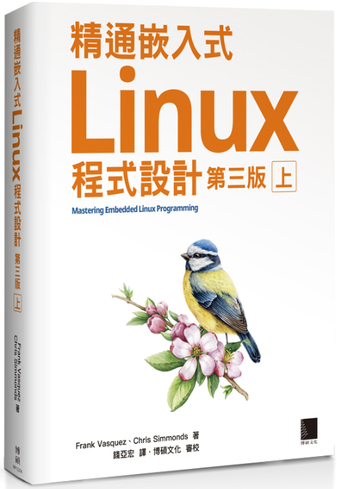

# Linux Porting 系列

這個系列會以這本書作為主要參考，加上 AI 協助整理知識、補足細節與快速驗證概念。

如果你有興趣，可以自行到天瓏購買：

https://www.tenlong.com.tw/products/9786263335110?list_name=srh

---

這個系列的目標是：
- 了解 Linux 系統移植的基本流程
- 學習交叉編譯、Bootloader、Kernel、rootfs 的整合方式
- 透過實作逐步建立一個可運作的嵌入式系統
- 利用 AI 協助理解書中概念、查找資料與驗證步驟

後續會依序整理相關主題與實作紀錄。